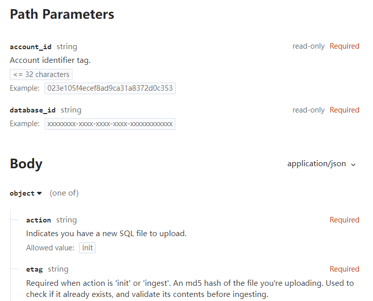

# D1Base数据库

## 查询语句

请求体

```apl
curl --request POST \
  --url https://api.cloudflare.com/client/v4/accounts/account_id/d1/database/database_id/query \
  --header 'Authorization: Bearer undefined' \
  --header 'Content-Type: application/json' \
  --data '{
  "params": [
    "firstParam",
    "secondParam"
  ],
  "sql": "SELECT * FROM myTable WHERE field = ? OR field = ?;"
}'
```

返回体

```json
{
  "errors": [],
  "messages": [],
  "result": [
    {
      "meta": {
        "changed_db": true,
        "changes": 0,
        "duration": 0,
        "last_row_id": 0,
        "rows_read": 0,
        "rows_written": 0,
        "size_after": 0
      },
      "results": [
        {}
      ],
      "success": true
    }
  ],
  "success": true
}
```

参数

```
account_id
string
read-only
required
Account identifier tag.

<= 32 characters
Example:
023e105f4ecef8ad9ca31a8372d0c353
application/json

application/json
params
array[string]
Example:
["firstParam","secondParam"]
sql
string
required
Your SQL query. Supports multiple statements, joined by semicolons, which will be executed as a batch.

Example:
SELECT * FROM myTable WHERE field = ? OR field = ?;
```

参数


## 写入语句

请求体

```apl
curl --request POST \
  --url https://api.cloudflare.com/client/v4/accounts/account_id/d1/database/database_id/import \
  --header 'Authorization: Bearer undefined' \
  --header 'Content-Type: application/json' \
  --data '{
  "action": "init",
  "etag": "string"
}'
```

响应体

```
{
  "errors": [],
  "messages": [],
  "result": {
    "at_bookmark": "string",
    "error": "string",
    "filename": "string",
    "messages": [
      "string"
    ],
    "result": {
      "final_bookmark": "string",
      "meta": {
        "changed_db": true,
        "changes": 0,
        "duration": 0,
        "last_row_id": 0,
        "rows_read": 0,
        "rows_written": 0,
        "size_after": 0
      },
      "num_queries": 0
    },
    "status": "complete",
    "success": true,
    "type": "import",
    "upload_url": "string"
  },
  "success": true
}
```

参数

