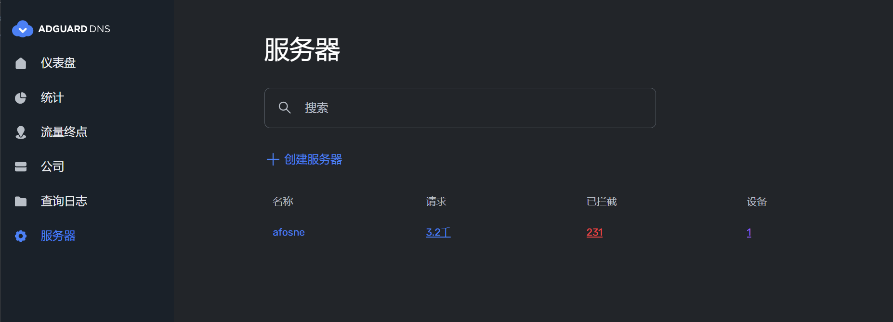
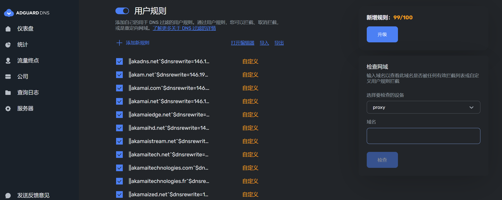
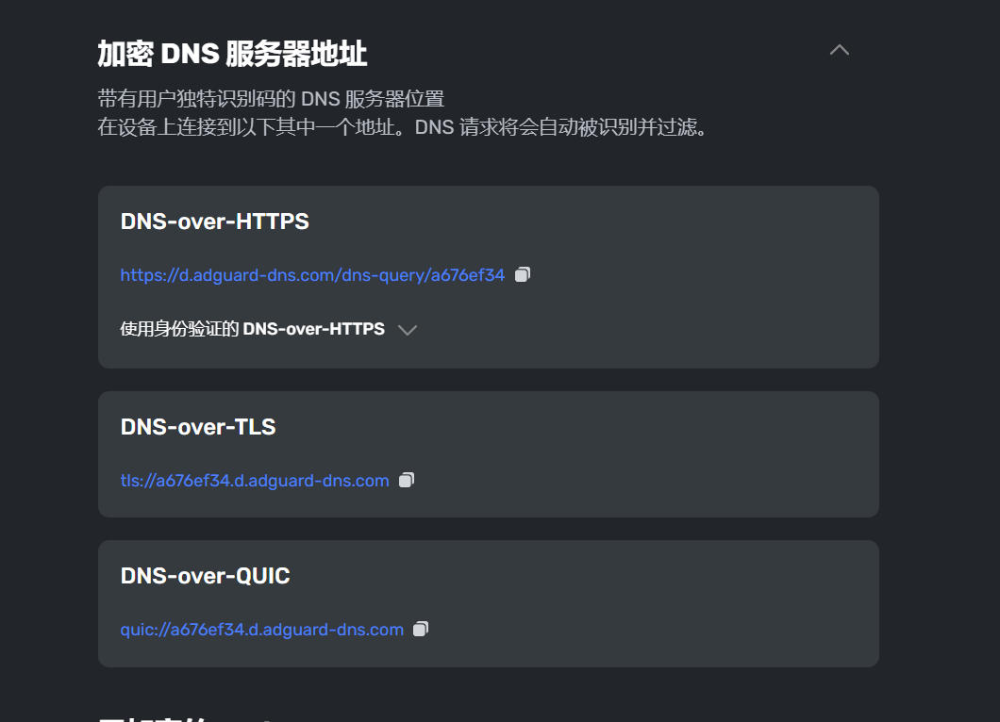
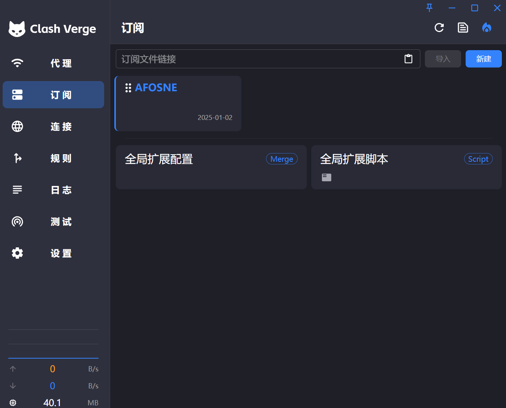
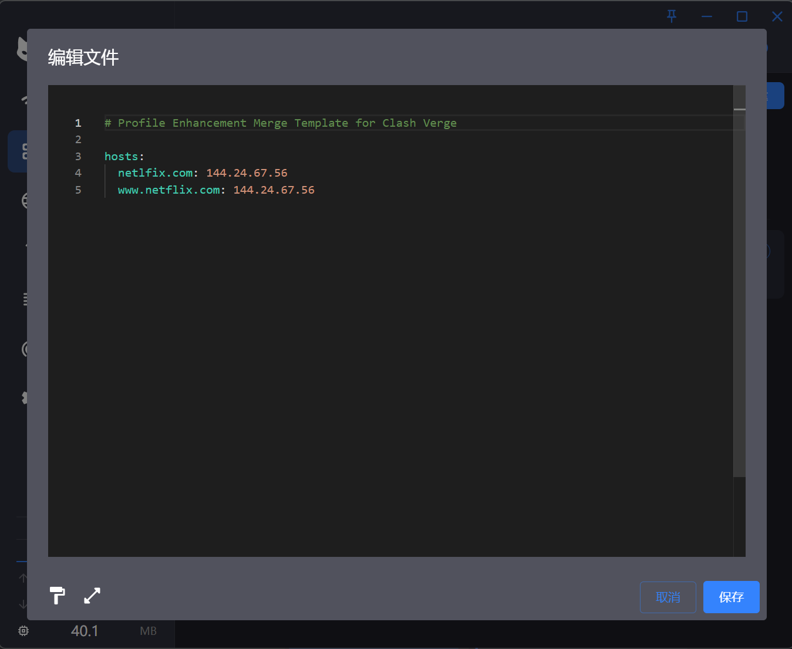

# DNS-Unlock

### 欢迎使用DNS-Unlock！！！本项目致力于DNS实现网络加速功能。

#### 原理简述

##### 利用DNS重写功能，对网站的来源进行重写，将特定网站的DNS解析重定向到[SNIproxy](https://github.com/dlundquist/sniproxy) 反向代理来实现对网站的加速的效果。

## 实现步骤

###获取方式已经发生变化！！！ 
首先是v1版本https://sni.afosne.us.kg/v1 只需要传入一个"country"参数即可获取SNIProxy服务器地址，其次我们增加了批量获取SNIProxy的方式通过请求https://sni.afosne.us.kg/v1s 并传入"country"和"size"参数来选择获取的数量,我们再次支持了get请求 方式为网址后面添加参数即可 例如 v1 可以通过https://sni.afosne.us.kg/v1/SG 来获取新加坡的SNIproxy v1s可以通过https://sni.afosne.us.kg/v1s/SG/1 即可获得一条数据
其次我们接入了adguard dns 为搭建提供免费的dns服务
#
首先我们需要注册[adguard dns](https://adguard-dns.io/)注册后请求https://sni.afosne.us.kg/adguard 参数需要”username","password","country","domains"等多个参数"username"和"password"为您在adguard dns平台的账号与密码"country"为你需要解锁的国家"domain"为您需要解锁的域名，该请求会返回您所需要的服务器地址并为您免费提供


```json
[
  {
    "ip": "146.190.100.69",
    "country": "SG",
    "Title": "该解锁为学习目的，请勿商用！！！",
    "city": "Singapore",
    "region": "Singapore",
    "org": "AS14061 DigitalOcean, LLC",
    "Message": "解锁状态不一定准确，具体情况请自行测试",
    "streaming": {
      "Netflix": {
        "success": true,
        "message": "https://www.netflix.com 解锁成功"
      },
      "Disney+": {
        "success": true,
        "message": "https://www.disneyplus.com 解锁成功"
      }
    }
  }
]
```

然后我们需要怎么去实现解锁呢？ 现在不需要服务器的实现主要有两种方法利用[adguard dns](https://auth.adguard.com/login.html)或者利用[cloudlfare zero trust](https://one.dash.cloudflare.com/)来实现解锁,本地实现可以通过clash 或者 v2ray 进行重写。

#### Cloudflare：

首先我们从cloudflare 提供的服务开始

登录到cloudflare zero Trust 后首先从Gateway找到DNS locations  并添加一个location地址 点击后可以返回 IPv4 endpoint、IPv6 endpoint、DoT endpoint、DoH endpoint 大部分情况下我们只需要使用DOT和DOH这两种就能满足所有需求：


接下来转到Firewall Policies


并像这样填入之前获取的SNIproxy服务器地址这样便实现了Netflix的解锁。


接下来点击DNS locations 获取的DOH地址，你便拥有了一个可以解锁Netflix的doh服务器啦！！！该doh可以填入浏览器中来实现无需要软件，无需国外网络，观看Netflix的效果


#### adguard :

相较于cloudflare Zero Trust ，adguard无需验证信用卡便能使用, 更加方便快捷！！！

登录adguard后,我们首先访问服务器并创建一个服务器



点击服务器名称进入服务器设置，并点击用户规则,免费用户能使用100个规则,以下是我常用的规则

```host
||netflix.com^$dnsrewrite={填入你更具api获取得到的ip地址}
||netflix.net^$dnsrewrite={填入你更具api获取得到的ip地址}
||nflximg.com^$dnsrewrite={填入你更具api获取得到的ip地址}
||nflximg.net^$dnsrewrite={填入你更具api获取得到的ip地址}
||nflxvideo.net^$dnsrewrite={填入你更具api获取得到的ip地址}
||nflxso.net^$dnsrewrite={填入你更具api获取得到的ip地址}
||nflxext.com^$dnsrewrite={填入你更具api获取得到的ip地址}
||hulu.com^$dnsrewrite={填入你更具api获取得到的ip地址}
||huluim.com^$dnsrewrite={填入你更具api获取得到的ip地址}
||hbonow.com^$dnsrewrite={填入你更具api获取得到的ip地址}
||hbogo.com^$dnsrewrite={填入你更具api获取得到的ip地址}
||hbo.com^$dnsrewrite={填入你更具api获取得到的ip地址}
||amazon.com^$dnsrewrite={填入你更具api获取得到的ip地址}
||amazon.co.uk^$dnsrewrite={填入你更具api获取得到的ip地址}
||amazonvideo.com^$dnsrewrite={填入你更具api获取得到的ip地址}
||disney.com^$dnsrewrite={填入你更具api获取得到的ip地址}
||disneyjunior.com^$dnsrewrite={填入你更具api获取得到的ip地址}
||disney-plus.net^$dnsrewrite={填入你更具api获取得到的ip地址}
||disney-portal.my.onetrust.com^$dnsrewrite={填入你更具api获取得到的ip地址}
||disney.demdex.net^$dnsrewrite={填入你更具api获取得到的ip地址}
||disney.my.sentry.io^$dnsrewrite={填入你更具api获取得到的ip地址}
||disneyplus.bn5x.net^$dnsrewrite={填入你更具api获取得到的ip地址}
||disneyplus.com^$dnsrewrite={填入你更具api获取得到的ip地址}
||disneyplus.com.ssl.sc.omtrdc.net^$dnsrewrite={填入你更具api获取得到的ip地址}
||disneystreaming.com^$dnsrewrite={填入你更具api获取得到的ip地址}
||hulu.jp^$dnsrewrite={填入你更具api获取得到的ip地址}
```



返回服务器，并点击设备，更具自己的需求创建设备后会给你专属于自己的ipv6dns服务器和加密服务器地址

更具cloudflare 给出的答案，现在你知道这三个的作用了吗！！！

### clash :

以Clash Verge方式实现（其他clash客户端依据此原理同样可行） ，同样我们首先需要获取Sniproxy服务器的配置信息。例如我需要解锁一个新加坡的Netflix服务，首先我们已经获取它的ip为'146.190.100.69',首先我们需要创建一个配置文件:



并创建一个配置文件，在扩展配置（如果您需求很多可以使用全局配置）中填写如下的参数就可以实现对Netflix的流量转发，将Netflix目标域名设置为直连，接下来敬请享受美好时光吧。




最后将获取到的DOH服务填入浏览器中的自定义DNS服务器地址当中就可以实现轻松观看Netflix，Disney+、hulu、或者使用chatGPT等功能，当然，每个返回的IP解锁的状态并不相同，或者被平台封禁的情况，我只能尽力保证服务的可用性。

如果您有任何疑问可以加入TG群https://t.me/Dns_Unlock

​	
