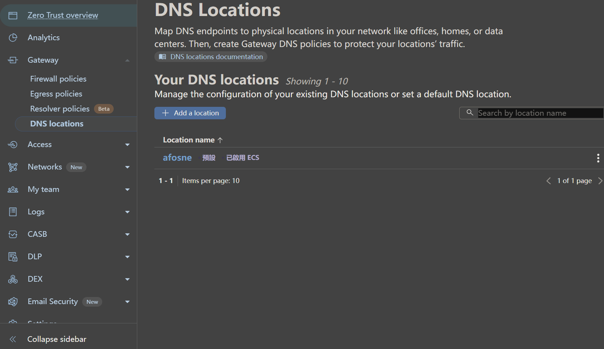
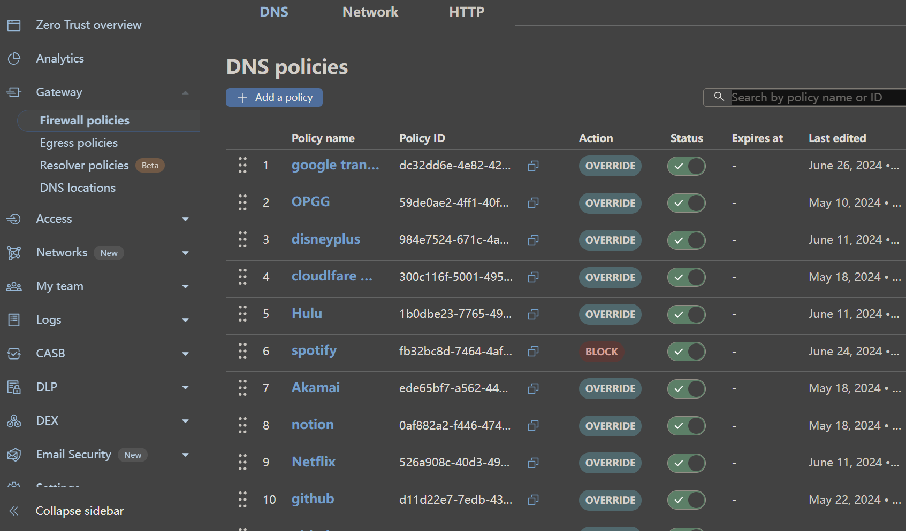
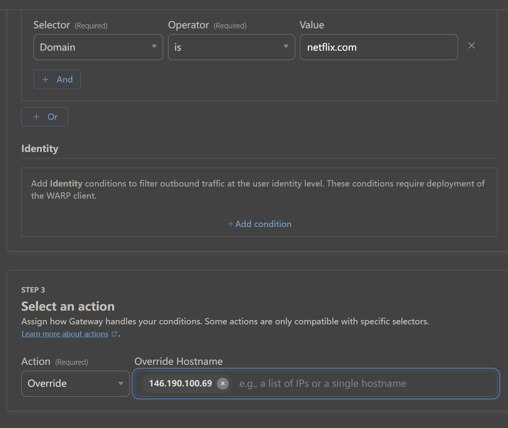
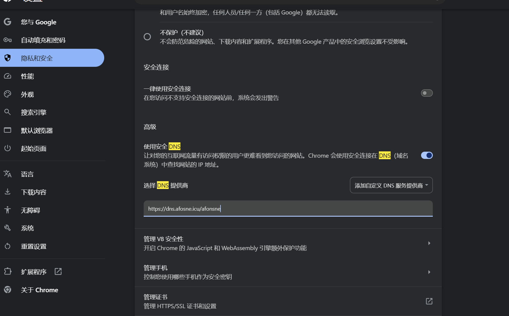

# DNS-Unlock

### 欢迎使用DNS-Unlock！！！本项目致力于DNS实现网络加速功能。

#### 原理简述

##### 利用DNS重写功能，对网站的来源进行重写，将特定网站的DNS解析重定向到[SNIproxy](https://github.com/dlundquist/sniproxy) 反向代理来实现对网站的加速的效果。

## 实现步骤

​	首先我们需要获取SNIproxy的服务器，我们可以通过该[https://sni.afosne.us.kg/get?country=新加坡&api=1](https://sni.afosne.us.kg/get?country=新加坡&api=1)来获取其中有两个参数"country"&"api"， 其中country为必填参数，api为可选参数（可不填或者添入1/2）这样可以获取到反向代理服务地址，例如我向"https://sni.afosne.us.kg/get?country=新加坡&api=1" 发送get请求后返回的值为:

```json
[
  "146.190.100.69"
]
```

​	然后我们需要怎么去实现解锁呢？ 现在不需要服务器的实现主要有两种方法利用[adguard dns](https://auth.adguard.com/login.html)或者利用[cloudlfare zero trust](https://one.dash.cloudflare.com/)来实现解锁。

#### Cloudflare：

​	首先我们从cloudflare 提供的服务开始

登录到cloudflare zero Trust 后首先从Gateway找到DNS locations  并添加一个location地址 点击后可以返回 IPv4 endpoint、IPv6 endpoint、DoT endpoint、DoH endpoint 大部分情况下我们只需要使用DOT和DOH这两种就能满足所有需求：



接下来转到Firewall Policies



并像这样填入之前获取的SNIproxy服务器地址这样便实现了Netflix的解锁。



接下来拿到DNS locations 获取的DOH地址填入浏览器



### adguard :(尽情期待)

​	最后将获取到的DOH服务填入浏览器中的自定义DNS服务器地址当中就可以实现轻松观看Netflix，Disney+、hulu、或者使用chatGPT等功能，当然，每个返回的IP解锁的状态并不相同，或者被平台封禁的情况，我只能尽力保证服务的可用性。

​	
