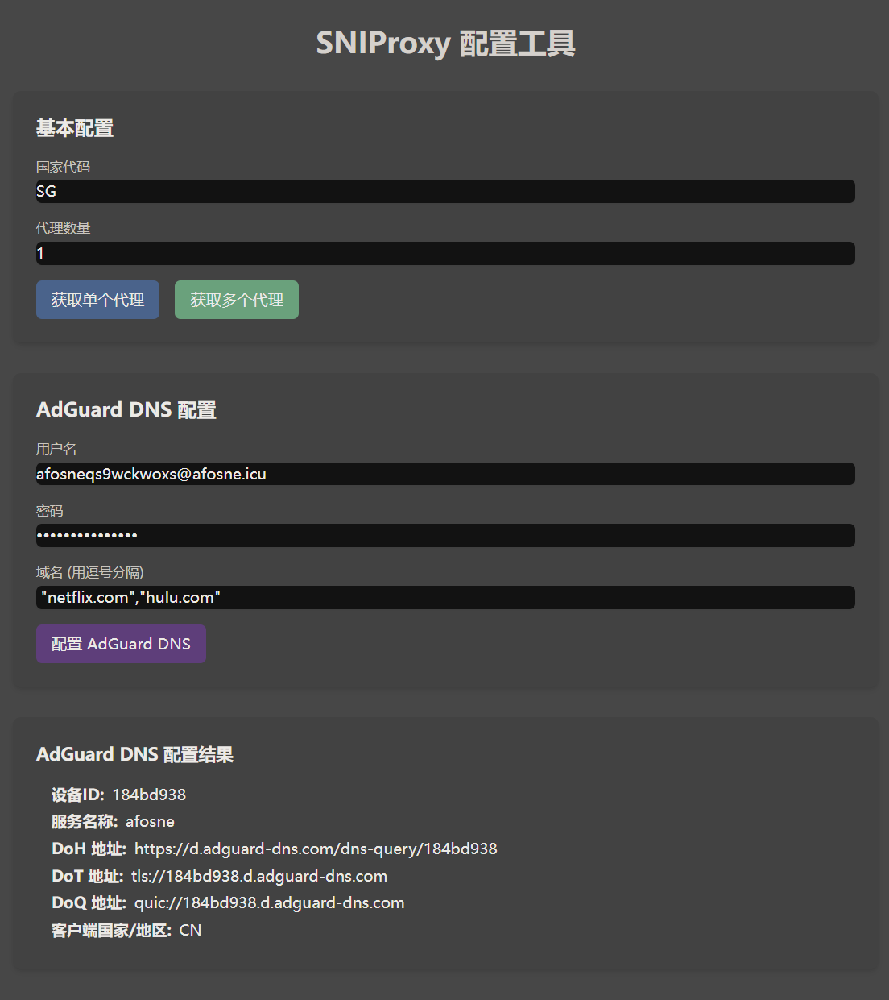

## DNS解锁使用DNS - UNLOCK

DNS解锁软件五花八门,我这里就将一些比较简单的实现:

首先是感谢[adguard-dns.io](https://adguard-dns.io/)的免费私人DNS服务,为本项目提供的大力支持!!!

##### 方法一:使用adguard提供的免费DNS服务

请按照一下步骤进行操作以获取DNS服务器地址:

1. 从[adguard-dns.io](https://adguard-dns.io/)
   通过邮箱注册一个账号并打开[DNS-UNLOCK 配置工具](https://snipage.afosne.us.kg/);

2. 填写基本配置中的国家代码(支持的 [国家列表](../config/country.json) )

3. AdGuard DNS 配置中填写邮箱注册的账号和密码;

4. 填入你想要解锁的域名(支持的 [域名列表](../config/domain.json) )

配置方法如下图所示


下面给出的服务器便可实现提供域名的解锁服务

```
- 设备ID:184bd938
- 服务名称:afosne
- DoH 地址:https://d.adguard-dns.com/dns-query/184bd938
- DoT 地址:tls://184bd938.d.adguard-dns.com
- DoQ 地址:quic://184bd938.d.adguard-dns.com
- 客户端国家/地区:CN
```

